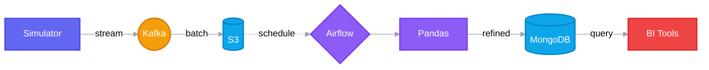

  
  
  # 🌍 Tour4Friends Analytics - Data Lake

> **Projeto Integrador - Tour4Friends**
> Uma arquitetura moderna de Data Lake para transformar dados brutos de turismo em inteligência de negócios.

---

  
<h2>👥 Integrantes do Grupo</h2>

  
   
  
  <table align="center">
    <tr>
      <td align="center">
        <a href="#">
           
          <b>Pablo Roberto</b>
        </a>
      </td>
      <td align="center">
        <a href="#">
           
          <b>Lucas Antonio</b>
        </a>
      </td>
      <td align="center">
        <a href="#">
           
          <b>Thiago Cardoso</b>
        </a>
      </td>
      <td align="center">
        <a href="#">
           
          <b>William Nunes</b>
        </a>
      </td>>
      </td>
      <td align="center">
        <a href="#">
           
          <b>Daniel Fernando</b>
        </a>
      </td>
      </tr>
    
  </table>
  

---

## 🔄 Arquitetura do Fluxo de Dados

